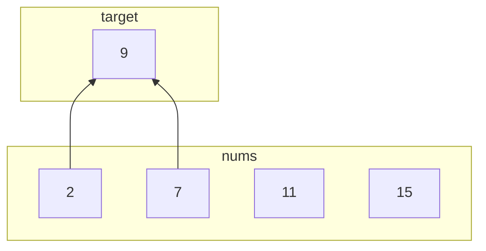
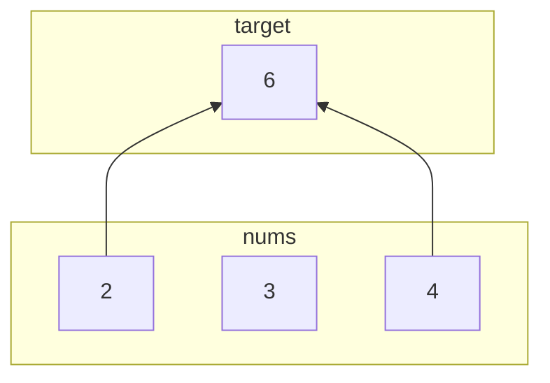

```toc
```
---
## 1. Two Sum
Given an array of integers `nums` and an integer `target`, return _indices of the two numbers such that they add up to `target`_.

You may assume that each input would have **_exactly_ one solution**, and you may not use the _same_ element twice.

You can return the answer in any order.

**Example 1:**
```Java
Input: nums = [2,7,11,15], target = 9
Output: [0,1]
Explanation: Because nums[0] + nums[1] == 9, we return [0, 1].
```

**Example 2:**
```Java
Input: nums = [3,2,4], target = 6
Output: [1,2]
```
**Example 3:**
```Java
Input: nums = [3,3], target = 6
Output: [0,1]
```

**Constraints:**

-   `2 <= nums.length <= 104`
-   `-109 <= nums[i] <= 109`
-   `-109 <= target <= 109`
-   **Only one valid answer exists.**

**Follow-up:** Can you come up with an algorithm that is less than `O(n2)` time complexity?

---
### Code
```Java
class Solution {
    public int[] twoSum(int[] nums, int target) {
    
    }
}
```

---
### Solution

#### Info

* `int[] nums`: We have an array of integers. 
* `int target`: integer 
* Return the indices of the two numbers such that they add up to the target.
	* return one solution only, there's always one solution
	* not repeated indices
```Java
int[] twoSum (int[] nums, int target)
```

#### Example

```Java
Input: nums = [2,7,11,15], target = 9
Output: [0,1]
Explanation: Because nums[0] + nums[1] == 9, we return [0, 1].
```




```Java
Input: nums = [3,2,4], target = 6
Output: [1,2]
```



#### Walkthrough
- iterate `nums` : `i = 0`
	- iterate `nums` : `j = i + 1` 
		- check `nums[i] + nums[j]` =? `target`
			- return `new int[]{i, j}`  
- return `null`

#### Brute force

```Java
for ( i = 0; i < nums.size(); i++ ) {
	for( j = i + 1: j < nums.size(); j++ )
		if(target == nums[i] + nums[j]){
			return new int[] (i, j);
		}
}
return null;
```

#### Optimization


#### Implement

## 2. Check Permutation
Given two strings, write a method to decide if one is a permutation of the other.

#### Info
2 strings {size, char} look for permutations
```Java
boolean isPermutation (String str1, String str2)
```

#### Example
```Java
str1 = "Racata"
str2 = "cataRa"
```

