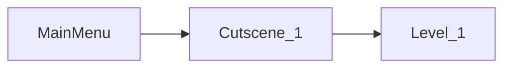

```toc
```
---
current progress:



---


## Story
This is going to be the whole story from start to end.

### Level 1: parking lot (tutorial)
**<u>Cutscene #1</u>**
The level will start with a cutscene of the cat going after the butterfly. The butterfly will stand in the hand rail then the cat will charge jump to get it but it will escape once again. Once the cat is in the rail, the game will end the cutscene.

**<u>Level #1</u>**
The game start with the player going out trying to catch the butterfly that will move along the parking lot. This will also serve as a tutorial for the different movements the player can do.

The first one will be the butterfly standing on a storage room. the cat will need to `push/pull` a trashcan to reach it. This will also have a tutorial sign close by (maybe in neon)

Once reached, the butterfly will fly to the roof. The next will be the `charge jump` which will show once the cat reaches the first position of the butterfly. This will show the player how to charge jump to reach the roof of the storage room.

Once reached, the butterfly will fly trough some of the cars which will give the player some time to practice. no new movements here. 

Once reached, the butterfly will fly to the bottom of a car. The player will learn how to `crouch` with a tutorial sign to reach the butterfly.

once reached, the butterfly will go to the top of a trailer truck . The player will need to learn how to `climb ladders` with a tutorial sign to reach it.

Once reached the butterfly will go to the elevator at the end of the parking lot ending the first level and starting Cutscene #2

**<u>Cutscene #2</u>**
Once reached, the butterfly will finally fly off the screen but the cat will notice another cat at the building next to it. Now we have a new objective. The can will then go to the elevator and click it to proceed. This zoom out a bit as the cat goes down the main focus will be the background to show off my incredible art skills as well as the credits which will be all me. 

I might add in a joke like "me again" "me but with a hat on" "surprise guest: me" "director emperor samurai: me" "hokage: me again" "artist: me but with glasses" "driver: me" "sound effects: me but with a cold" the scene will not reach the bottom it will just black out ending the cutscene.

### Level 2: crowded street and building 
**<u>Cutscene #1</u>**
The level will start with a cutscene of the cat reaching the bottom of the elevator and exiting the elevator. then the elevator will go up and offscreen. Once the cat is off, the player will regain control. 

**<u>Level #2</u>**
The first objective will be simply to cross the crowded street. Might give me more opportunities to show off my art styles.

**idea**
thinking of adding a car animation with a death box when the animation reaches a certain point.

After the player crosses the street it will reach the first puzzle.

	First Puzzle idea :
	The emergency stairs from an abandoned building that will make the player use charge 
	jump, and pull/push to reach the top to unlock the door >

after the puzzle, the player will have to cross another crowded street and go into another building which has another elevator that goes up. Once the player reaches a certain point the next cutscene will start.

**<u>Cutscene #2</u>**
The cat will walk slowly into the elevator and press the trigger to go up. the camera will follow the cat but the whole screen will darken ending the level.

### Level 3: apartment floor 1
**<u>Cutscene #1</u>**
As the elevator approaches the top floor, the elevator will start to stagger and finally stop a floor below and get stuck forcing the cat to get out before reaching the roof. The cutscene will end as the cat gets out into an empty apartment with the alarm set up.

**<u>Level #3</u>**

The player will try to reach the main door by `jumping` from Roomba to Roomba as well as `climbing` curtains as well as `jumping` from window cleaner robots. 

Once reached, the player will see that is close and will have to backtrack to go to the chimney The player will do that by going trough the chimney and `wall jumping` all the way to the second floor.

Once reached, the player will go trough more Roombas and window cleaners until it reaches the window which will the the end of the level and will trigger a short cutscene.

**<u>Cutscene #2</u>**
Once the window is reached the cat will go out the window as the screen darkens and end the level.

### Level 4 (emergency stairs to the roof)
**<u>Cutscene #1</u>**
The cat will go out the window and into the emergency stair way. 

**<u>Level #4</u>**
The cat will not be able to go down so it will have to go up. The stairs will be very dirty and poorly taken cared of so they will have a bunch of boxes to `pull/push` as well as cloth hanging where the cat can `climb` up. Also some of the apartments will have small elevators for laundry that will have a `switch` for the cat to push. the level will end once the cat reaches the roof.

**<u>Cutscene #2</u>**
As the cat reaches the roof, we will see the gray cat and it will notice you but will get distracted by a drone butterfly flying around, then the player will pursue them both but as you reach the edge of the building you will notice that somehow the cat is playing with the butterfly in the next building which happens to be a factory which also is where the player will notice that there's a line of public ads which can work as zipline aiming to that other building which is where the level will end.

### Level 5 (ziplining to the factory)
**<u>Cutscene #1</u>**
The cat will simply jump down to where the zipline is and that is where the cutscene will end.

**<u>Level</u>**
The player will get some tutorial signs for how to `zipline` then it will just start. The ads will be moving and with damaged parts that will have a death box to jump over and avoid. This will be most of the level.

**<u>End Cutscene</u>**
As the cat reaches the Factory you will see the gray cat again playing with the butterfly running into the Factory.

### Level 6 (Factory first floor)
**<u>Intro Cutscene</u>**
As you enter you will see a lot of moving parts as well as a lot of noises. Then you will see that the gray cat is running upstairs which is where your next goal will be. As the gray cat runs, some of the boxes will drop and cover the stairs making you have to go around.

**<u>Level</u>**
The level will include a lot of `moving platforms` as well as fire areas. It will also have some time sensitive areas where you have to reach the end before th4e `finger parts` fall on the player.


**<u>End Cutscene</u>**


### Level 10 (endgame)
**<u>Cutscene #1</u>**
The cat reach the roof of the factory building. and get out of the elevator. before the door opens you will see the gray cat running off screen still pursuing the butterfly. The cutscene will end once the door is open.

**<u>Level #10</u>**
This will be an easy puzzle meant to give closure to the story. the only thing the player will have to do is run straightforward and maybe jump over some boxes. the level will end once the player reaches the cat. 

**<u>Cutscene #2</u>**
Once the gray cat is on screen the player will slowly walk toward it until if reaches it, at this point the gray cat will explode into a million drone butterflies. then the player will reach the edge of the building and stare into the void and also explode into a million drone butterflies.

All this time it wasn't a cat just a bunch of rogue self conscious drones wanting to be a part of something bigger by making themselves look like an animal who is always free to do whatever they want, cats. (which by then would have been long extinct)


## Mechanics
### Movements
The movements will include any motions that can be done in an empty space like:

- [ ] MOVE
	- [ ] Code
		- [ ] walk
		- [ ] run
		- [x] sprint
		- [x] jump
		- [x] crawl
	- [x] Animations
		- [x] walk
		- [x] run
		- [x] sprint
		- [x] jump
		- [x] crawl

### Interactions
The interactions will include any motions that can be done either with the level or with objects in the level, like:
- [x] `wall jumping`
- [x] `wall slide`
- [x] `climbing ledges`
- [x] `ledge hanging`
- [ ] `rope swing`
- [x] `pull`
- [x] `push`

### Abilities 
The abilities will include anything that is not natural to a cat like with cybernetics like:
- [ ] `double jump`
- [ ] `shoot lazers`
- [ ] `sonar`


## Tutorial
1. Setting up the project
	- Install Unity
	- download asset
2. What's in it
	- Structure of the project
	- What can you do with it
3. How to adjust it to your needs
4. Adding your Sprites
5. Adding UI:
	- Start Menu / 
	- Intro Screen/ Credit Screen
	- 

**Questions to answer:**
1. How are abilities being used
2. Where is the Jump button being processed


**What I'm trying to do:**
The ability modules follow a certain order. I made a test print to see what's being ran first.

Look for other modules that also interact with a game object and copy their procedure.

### Scenes
#### Intro
**What**
This will explain a part of the story which as of now is nonexistent.

**How**
This is done with a `Timeline` which you can put things like words and animations as well as change scenes
#### MainMenu
**What**
This will start with a short chilling animation loop waiting for the player to chose

**How**
This will be a regular menu with two buttons on a `Canvas` object with a `MenuHandle` script [^1]
- Start
- Quit
#### Level_1
**What**
This will be the start of our adventure in the world of CyberCat Starting with a short animation of the cat leaving a building. Also, it will have the introduction to the main game mechanics with a tutorial with all the **main** things you can do.[^2]

**How**
Do it with an image telling how to do it just like in the stick figure example
#### Cutscene_1
**What**
This will be the introduction cinematic which will will be where the intro credits will roll as the cat waits for the lift to reach the bottom

**How**
Play cinematic then end the scene by switching to level 2

[^1]: Need to find a way to save the progress. maybe just the level
[^2]: Don't overwhelm the player, just show necessary for completing the next level